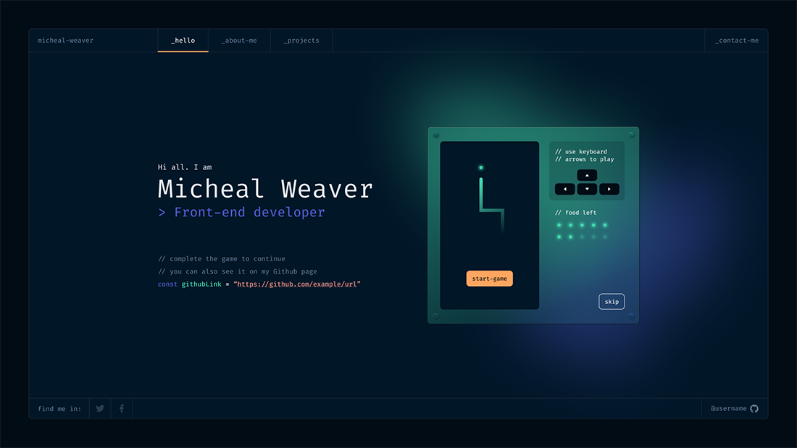

# 🚀 developer-portfolio-v2

> Personal portfolio by **Nur Muchson Rahwanda Seto** ([GitHub](https://github.com/mrcodebase))
>
> Built with [Nuxt.js 3](https://nuxt.com/) · Styled with Tailwind CSS · Hosted on [Netlify](https://www.netlify.com/)
>
> 

---

## ✨ About

A modern, open-source developer portfolio to showcase my work, skills, and digital journey. Designed for speed, clarity, and creative expression.

- **Tech Stack:** Nuxt.js 3, Vue, Tailwind CSS, TypeScript
- **Features:** Animated UI, dynamic content, gist/code integration, responsive design
- **Content:** Projects, About Me, Skills, Contact, Gists

---

## 🛠️ Getting Started

1. **Clone the repository**
   ```sh
   git clone https://github.com/mrcodebase/porto.git
   ```
2. **Install dependencies**
   ```sh
   yarn
   ```
3. **Start the development server**
   ```sh
   yarn dev
   ```
4. **Visit** [http://localhost:3000](http://localhost:3000)

---

## 🖊️ Customization

- Edit `developer.json` for your profile, projects, skills, and contact info
- Update `nuxt.config.ts` for meta tags and config
- Change styles, colors, and layout to match your brand

---

## 🏗️ Build & Deploy

1. **Build for production**
   ```sh
   yarn build
   ```
2. **Preview production build**
   ```sh
   yarn preview
   ```
3. **Deploy to Netlify, Vercel, or your favorite host**

---

## 📬 Contact & Credits

- Portfolio by [Nur Muchson Rahwanda Seto](https://github.com/mrcodebase)
- Inspired by open-source and developer communities

---

## 📄 License

MIT License. See [LICENSE](./LICENSE).